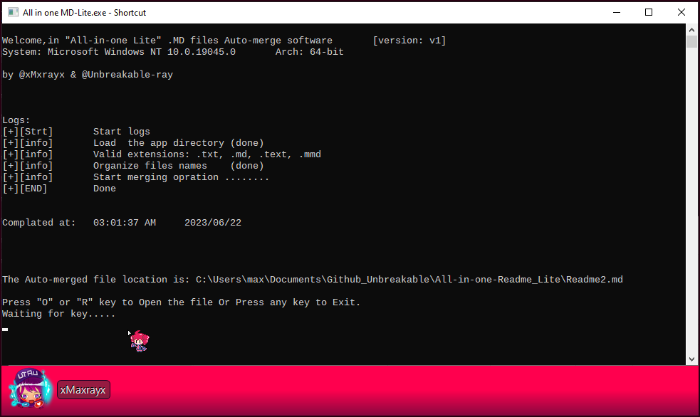

# All in one Readme merge app

Small light one-click software to auto-merge readme files `.MD` in the correct order.

# Preparation:

- All Files should be in **one place** inside the `sub-Readme` Folder 

  **Note**: if you want to edit them in a different location then you should make a shortcut to your wished place.

  **Note**: don't put any files inside a child folder, this app doesn't support this future yet and wont merge them.

     

- All data like images should be in the `Readme-Data` folder.

  you can lock at `Tybore config`  section

   

# How to use:

Simply just run it and the App will do Files merging automatically, after that, you need to press any key to exit.

# Change log

## 1.0.0

  - Fixed a bug when `header.md` and `footer.md` and `author.md` files are missing.
  - Added Extinction filtering support.

# 

# Image history (For fun).

### 1.0.0.

@xMaxrayx @Unbreakable-ray   at 14:19:00  on 23/6/2023   (24H Formart)  (UTC +2).

------

  My first idea for the logo I want something boxes and that blend together.

I made `Ico` files for my app.

------

Updated at 02:29:38 PM 2023/06/23	@xMaxrayx	@Unbreakable-ray

