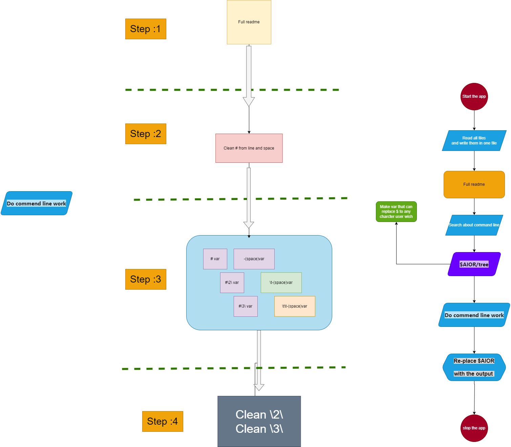
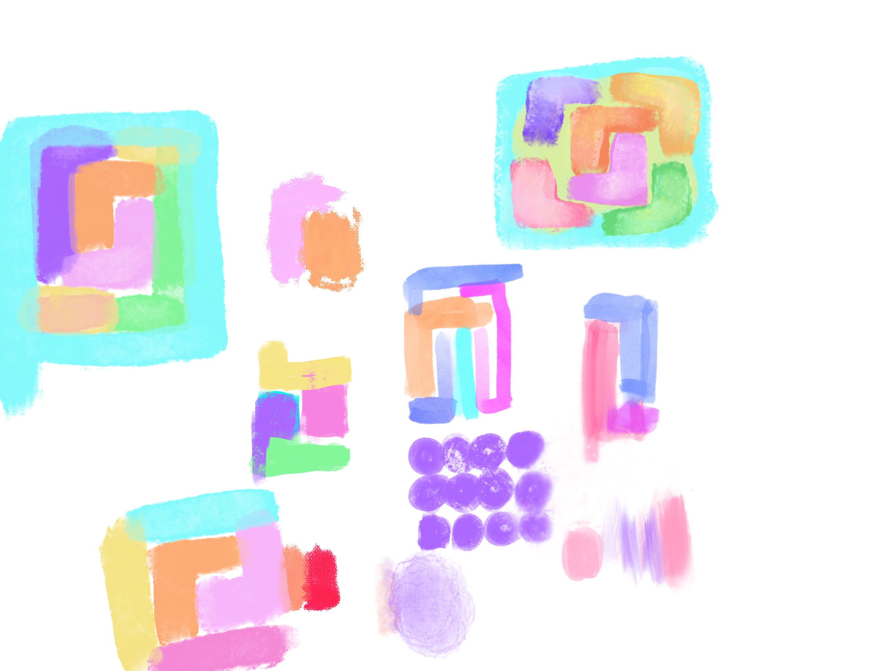
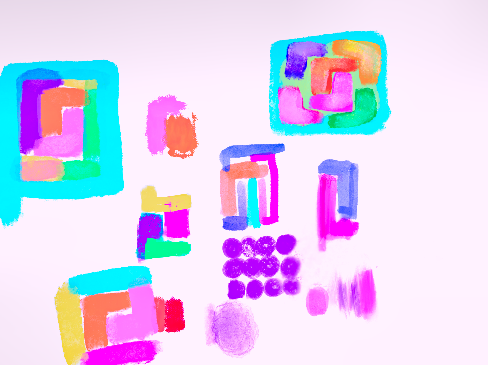

# All in one Readme merge app

Small light one-click software to auto-merge readme files `Text` `.MD` in the correct order.

    

# Preparation:

- All Files should be in **one place** inside the `sub-Readme` Folder 

  **Note**: if you want to edit them in a different location then you should make a shortcut to your wished place.

  **Note**: don't put any files inside a child folder, this app doesn't support this future yet and wont merge them.

     

- All data like images should be in the `Readme-Data` folder.

  you can lock at `Tybore config`  section

   

# How to use:

Simply just run it and the App will do Files merging automatically, after that, you need to press any key to exit.

# Change log

## 1.1.0

 

- Added Option to Open file directory .

- Add Auto-Close future after 10 sec.

- From now All-in-one will rename old files  `Readme.md` to `oldReadme.bak.md` .

- Add a new Icon.

- Change `Updated` to `Auto-merged`.

- add `.bat` file to run the app instead of `.ink` (shortcut)

###### @xMaxrayx @Unbreakable-ray           at 18:06:07  on 23/6/2023    (24H Formart)  (UTC +2)

## 1.0.0

  - Fixed a bug when `header.md` and `footer.md` and `author.md` files are missing.
  - Added Extinction filtering support.

###### @xMaxrayx @Unbreakable-ray           on 22/6/2023  

# Plans for All-in-one Readme v2.

- Make `Tree` content.

- Clean # title from New line and space. 

       

  
   

# Image history (For fun).

### 1.0.0   

My first idea for the logo I want something boxes and that blend together.

I made `Ico` files for my app.

@xMaxrayx @Unbreakable-ray   at 14:19:00  on 23/6/2023   (24H Formart)  (UTC +2).

------

Auto-merged at 04:15:12 PM 2023/06/24	@xMaxrayx	@Unbreakable-ray

Auto-merged by "All-in-one" app 

[All-in-one app]: https://github.com/Unbreakable-ray/All-in-one-Readme_Lite	"All-in-one app"

