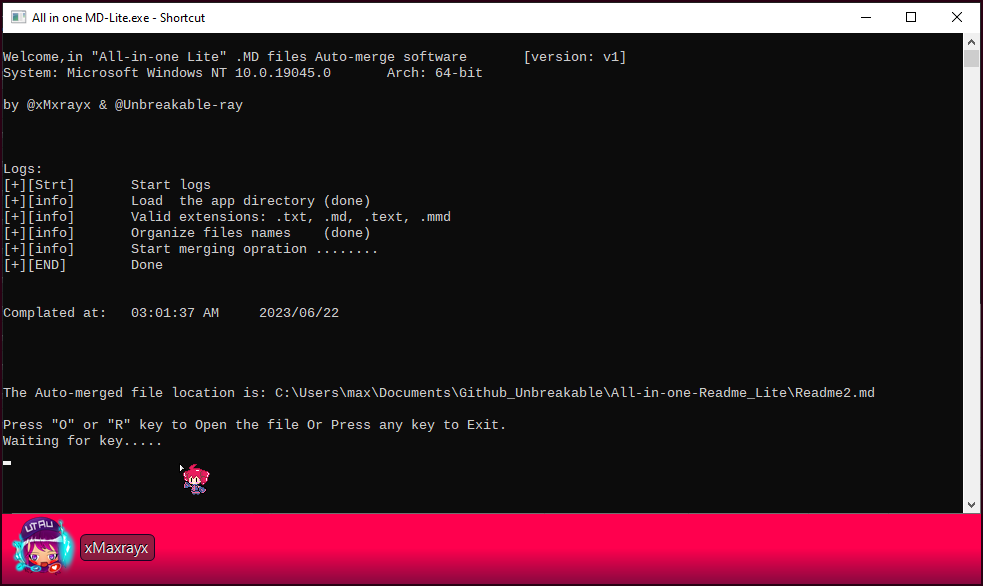

# All in one Readme merge app

Small light one-click software to auto-merge readme files `Text` `.MD` in the correct order.

    

# Preparation:

- All Files should be in **one place** inside the `sub-Readme` Folder 

  **Note**: if you want to edit them in a different location then you should make a shortcut to your wished place.

  **Note**: don't put any files inside a child folder, this app doesn't support this future yet and wont merge them.

     

- All data like images should be in the `Readme-Data` folder.

  you can lock at `Tybore config`  section

   

# How to use:

Simply just run it and the App will do Files merging automatically, after that, you need to press any key to exit.

