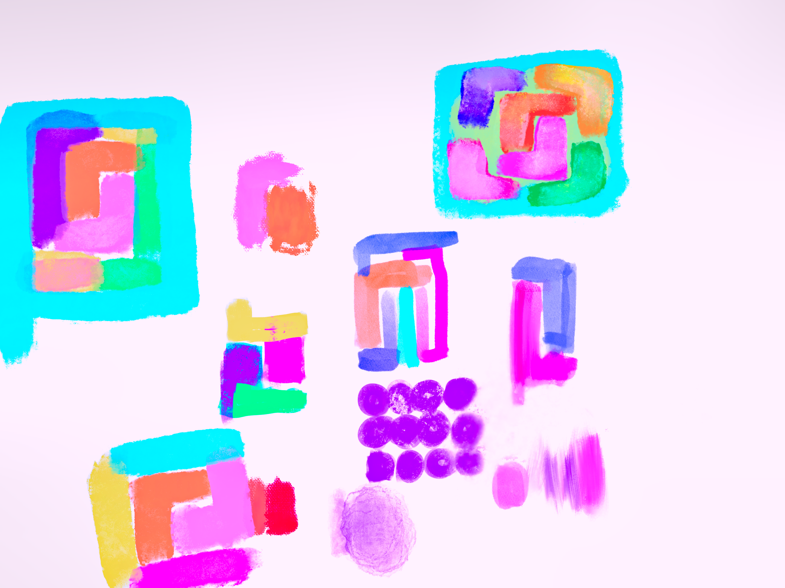

   

# Image history (For fun).

### 1.0.0   

My first idea for the logo I want something boxes and that blend together.

I made `Ico` files for my app.

@xMaxrayx @Unbreakable-ray   at 14:19:00  on 23/6/2023   (24H Formart)  (UTC +2).

------

